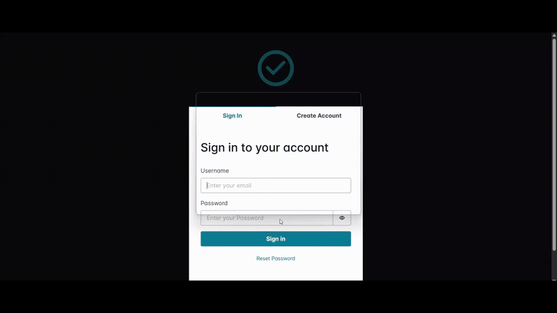

# ✅ Tasks – Serverless Full-Stack App
A fully serverless task management application built with AWS (SAM, Lambda, Cognito, DynamoDB), React, and Chakra UI. Authenticated users can create, assign, update, and track tasks. Includes a modern frontend with a polished UI and secure backend with CI/CD.<br>
**Live Demo:** https://tasks-nomaan.netlify.app/
<br>**Backend Repo:** ```./task-manager-backend```
<br>**Frontend Repo:** ```./task-manager-frontend```
<br>CI/CD for the backend is defined in ```.github/workflows/deploy-backend.yml```

## 🌟 Overview

- Serverless backend on AWS (API Gateway + Lambda + DynamoDB)
- Auth with AWS Cognito (Sign Up, Sign In, JWT-based auth)
- Role-aware task assignment
- React + Chakra UI frontend
- GitHub Actions CI/CD for backend, Netlify for frontend


## 🧱 Backend - AWS SAM

Located in ```/task-manager-backend```

### 🔨Stack

- **AWS Lambda** – stateless compute
- **API Gateway** – REST endpoints
- **DynamoDB** – NoSQL storage for users and tasks
- **Cognito** – user pool + secure authentication
- **PostConfirmation Lambda** – inserts new users into DB
- **AWS SAM** – infrastructure-as-code


### 📁 Main Resources

| Function              | Description                            | Method | API Path             |
|-----------------------|----------------------------------------|--------|------------------|
| `add_tasks`     | Create a new task                      | POST   | `/tasks`         |
| `get_tasks`    | Get tasks created by or assigned to me | GET    | `/tasks`         |
| `update_task`  | Update task title or status            | PUT    | `/tasks/{id}`    |
| `delete_task`  | Delete a task                          | DELETE | `/tasks/{id}`    |
| `fetch_user`          | Get info about the logged-in user      | GET    | `/me`            |
| `get_users`       | List all users (for assign UI)         | GET    | `/users`         |

### 🚀  Deployment (CI/CD via GitHub Actions)


- Push to main auto-triggers sam deploy

- Stack name: task-manager-backend

- ```.github/workflows/deploy-backend.yml``` defines how deployment should happen

## 🖼️ Frontend – React + Vite + Chakra UI
Located in ```/task-manager-frontend```

### 🎬 Demo


### 🛠 Stack

- **React (Vite)** - Frontend framework

- **Chakra UI** – clean, responsive components

- **Amplify Auth** – to access Cognito login/signup

- **Netlify** - Automatically deployed via Netlify on push

### 🔐 Auth Flow
- Sign Up / Sign In via Amplify UI

- JWT passed in Authorization headers for all protected routes

- PostConfirmation Lambda stores new users into DB for tasks to be assignable to them

## 🪜Future Enhancements

- Creation of user groups

- Add due dates, and priorities

- Allow task commenting and descriptions

- Notifications for assigned tasks